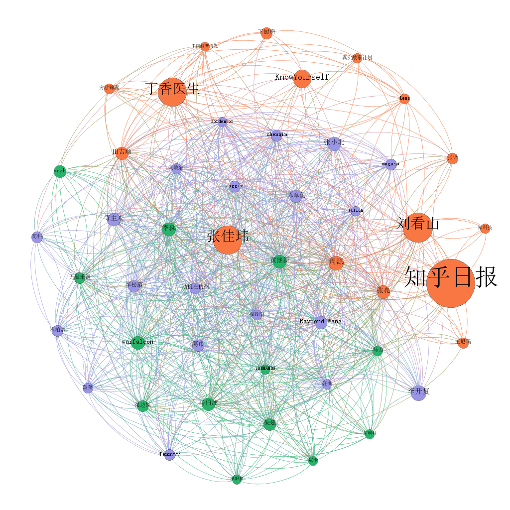

# 2019年7月知乎大 V 数据分析
## 项目内容
### 数据
* 截止2019.7.23，抓取知乎粉丝数 **1w** 以上用户个人信息（**9385**），包括回答数、文章数、粉丝数、获得收藏数、获得感谢数、获得赞同数、收录文章数、收录回答数、关注的收藏夹、专栏；
* 粉丝数 **10w** 以上用户(**938**)回答及文章详细信息；
* 根据知乎高关注度用户基本数据进行数据可视化分析，绘制图表包括：
   1. **1w 关注用户** 用户回答数、收录回答数、文章数、收录文章数、粉丝数、赞同数、获得感谢数、获得收藏数、关注收藏夹、专栏 **前50**排名柱状图；
   2. **1w 关注用户** 用户回答数、点赞数、粉丝数散点图、用户收录回答数、收录文章数、粉丝数散点图；
   3. **1w 关注用户** 粉丝数前 50 用户关系图；
   4. **10w 关注用户** 回答、文章月变化图，及年发布问答文章柱状图；
   5. **1w 关注用户** 用户信息词云。
* 效果图链接如下，图片解释见**文件说明**。注意请耐心等待10秒左右，会有些慢：
   * https://htmlpreview.github.io/?https://raw.githubusercontent.com/spiderbeg/zhihu_data/master/zhihu_html/zhihu_user.html
   * https://htmlpreview.github.io/?https://raw.githubusercontent.com/spiderbeg/zhihu_data/master/zhihu_html/zhihu_p.html
* 更多实用而有趣的分析案例请关注：<strong>Crossin的编程教室</strong>
## 项目思路
1. 知乎是以回答为主的知识社区，为分析知乎高关注用户的基本情况，从高关注用户**张佳玮**关注用户开始抓取粉丝数 1w 以上用户，并以此类推，直至抓取完毕；为获得回答数、粉丝数、点赞数等相关排名。依据**获取的用户数据**抓取知乎粉丝数 1w 以上用户主页文章、回答、获得赞同数等数据及详细的回答、文章数据；
2. 使用 scrapy 分别抓取用户数据并使用 mongodb 储存；
3. 使用可视化工具 pyecharts, 对数据进行可视化处理；
4. 整理分析。
## 运行环境
* python3.7
* windows
* jupyter notebook
* mongodb
## 运行依赖包
* pymongo
* scrapy
* pyecharts
* jieba
* wordcloud
## 文件说明
### code 项目代码
* **user.py** 获取关注度 1w 以上用户 id。
* **zhihu** scrapy 项目代码文件，user_data.py 粉丝数 1w 以上用户信息抓取代码； article.py 粉丝数 10w 以上用户文章信息抓取；huida.py 粉丝数 10w 以上用户回答信息。
* **user_info.json** 粉丝数1w以上用户相关数据，即**zhihu_plot.ipynb**中集合 user_info 的数据。
* **zhihu_plot.ipynb pyecharts** 图表绘制代码，可视化库使用 pyecharts。
### zhihu_html 
* 里面包含可视化操作后的大部分文件；
* **zhihu_user.html** 主要为 pyecharts 绘制的**1w 粉丝用户**粉丝数、点赞数、回答数等排行及用户回答数、点赞数、粉丝数散点图、用户收录回答数、收录文章数、粉丝数散点图；
* **zhihu_p.html** **1w 粉丝用户**关注收藏夹、专栏前50排行及**10w 粉丝用户**用户回答、文章月变化图，及年发布问答文章柱状图；
* **zhihu.jpg** 粉丝数 1w 以上用户信息词云。
### node
* 粉丝数前50的高关注用户关系图；
* **node50.xlsx** gephi 所需的节点文件，文件中 id 列为粉丝数前50用户名, weight 列为粉丝数；
* **edge50.xlsx** gephi 所需的边文件，文件中 target 列为关注用户，source 列为被关注用户；
* **zhihu.gephi** 为生成的图文件，可直接用 gephi 打开，gephi 具体操作可见<https://github.com/spiderbeg/marvel-gephi>；
* **zhihu_module.png** 为以粉丝数为节点大小的用户关系图；
* **zhihu_连出度.png** 为以用户关注数为节点大小的用户关系图；
* **zhihu_连入度.png** 为以用户被关注数为节点大小的用户关系图。
## 一些建议及注意事项
## 建议
* 如何安装 git 见 <https://mp.weixin.qq.com/mp/appmsg/show?__biz=MjM5MDEyMDk4Mw==&appmsgid=10000361&itemidx=1&sign=f88b420f70c30c106697f54f00cf2a95>；
* MongoDB 安装：<http://mongoing.com/archives/25650> ；使用：<https://juejin.im/post/5addbd0e518825671f2f62ee>;
* gephi 具体操作可见<https://github.com/spiderbeg/marvel-gephi>；
* 不熟悉 scrapy 的瞧一眼这里：<https://cuiqingcai.com/3472.html>;
* scrapy 项目抓取代码中用到了 web 代理及多 cookie，需在填入自己的 web 代理及 cookie 值。就抓取时间 2019-7-23 来说不单用户单 IP 的抓取时间间隔为 0.45s, 具体时间与状况还需各位亲自尝试；
* pyecharts 绘制图形生成 html 文件，为方便本地查看可视化效果。把所需的 js 文件一并放置于此目录下；因此建议下载整个**zhihu_html文件夹**到本地后查看。
## scrapy 设置的简单介绍
* scrapy 的设置文件在 /zhihu_data/code/zhihu/settings.py 中，
 * ROBOTSTXT_OBEY = False 表示不遵守爬虫规则；
 * DOWNLOAD_DELAY = 0.15  表示下载延迟为0.15秒；
 * COOKIES_ENABLED = False 表示若需要cookie，则自己设置cookie。
## 如何跑起来
1. 确定好放置项目位置

         git clone https://github.com/spiderbeg/zhihu_data.git

2. 在 /zhihu_data/code 中 user.py 获取关注数过 1w 用户 id; 进入 /zhihu_data/code/zhihu/spiders 文件夹，打开 user_data.py, article.py, huida.py, **写入自己的代理，及cookie**。打开控制台，进入 /zhihu_data/code/zhihu, 输入以下命令，即可抓取粉丝数 1w 以上用户回答数、点赞数、粉丝数等信息。 

         scrapy crawl user_data

3. 用户信息抓取完毕后，按照第二步所示命令，修改 user_data 为 article，为抓取粉丝数 10w 以上用户发布文章信息，huida 则为粉丝数 10w 以上用户回答的详细信息。
4. 找到 /zhihu_data/code/zhihu_plot.ipynb, 可直接将此文件放置于 jupyter notebook 文件夹下，修改生成图表文件路径即可。 
5. 部分代码
* 连接 MongoDB:

        def get_ready(ch='reply_user',dbname='hupu'): # ch: 表名，dbname: 数据库名
            '''数据库调用'''
            global mycol, myclient,myhp
            myclient = pymongo.MongoClient("mongodb://localhost:27017/")
            mydb = myclient[dbname]
            mycol = mydb[ch]
            myhp = mydb['posts_user']
 
* scrapy 保存数据到数据库 piplines.py; 以下为官方示例<https://scrapy-chs.readthedocs.io/zh_CN/1.0/topics/item-pipeline.html>，本项目已经配好请直接使用：

        import pymongo

        class MongoPipeline(object):

            collection_name = 'scrapy_items' # 爬虫名

            def __init__(self, mongo_uri, mongo_db): # 初始化参数
                self.mongo_uri = mongo_uri
                self.mongo_db = mongo_db

            @classmethod
            def from_crawler(cls, crawler):
                return cls(
                    mongo_uri=crawler.settings.get('MONGO_URI'),
                    mongo_db=crawler.settings.get('MONGO_DATABASE', 'items')
                )

            def open_spider(self, spider): # 爬虫开启时调用
                self.client = pymongo.MongoClient(self.mongo_uri)
                self.db = self.client[self.mongo_db]

            def close_spider(self, spider): # 爬虫关闭时调用
                self.client.close()

            def process_item(self, item, spider): # 每个item pipeline组件都需要调用该方法，这个方法必须返回一个具有数据的dict，或是 Item (或任
                self.db[self.collection_name].insert(dict(item)) # 何继承类)对象， 或是抛出 DropItem 异常，被丢弃的item将不会被之后的
                return item                                      # pipeline组件所处理。

## 部分效果展示
* 粉丝数 1w 以上用户信息词云图
 
* 粉丝数前50用户关系图（节点大小代表粉丝数）
 
## Crossin的编程教室
* 更多实用而有趣的分析案例请关注：**Crossin的编程教室**  
   
